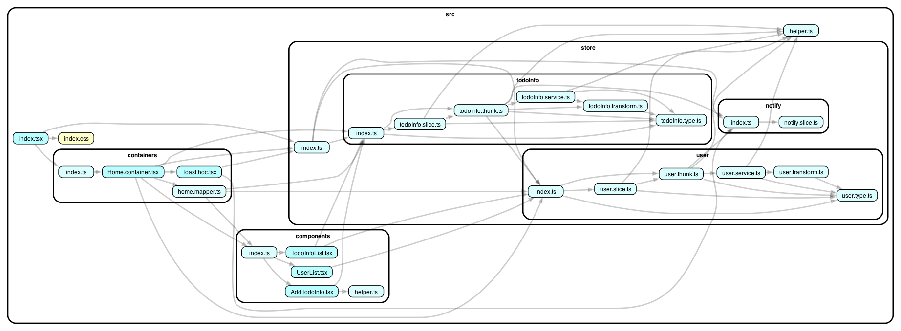

# Todo-List

In the project directory, you can run:

### `pnpm server:start`
Runs the app in the development mode. 

### `pnpm client:start`

Runs the app in the development mode. 
Open [http://localhost:3000](http://localhost:3000) to view it in the browser.

## Architecture

